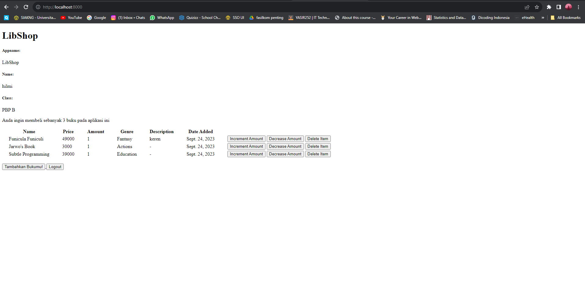
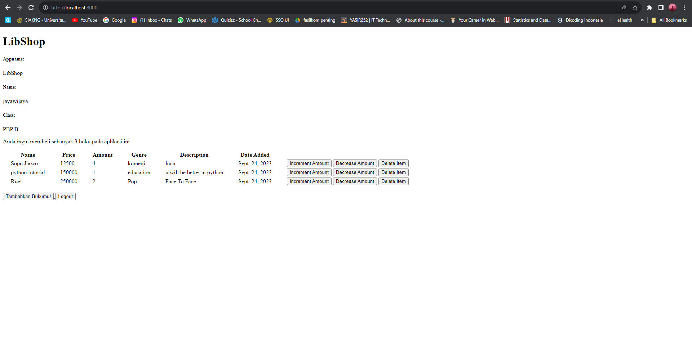
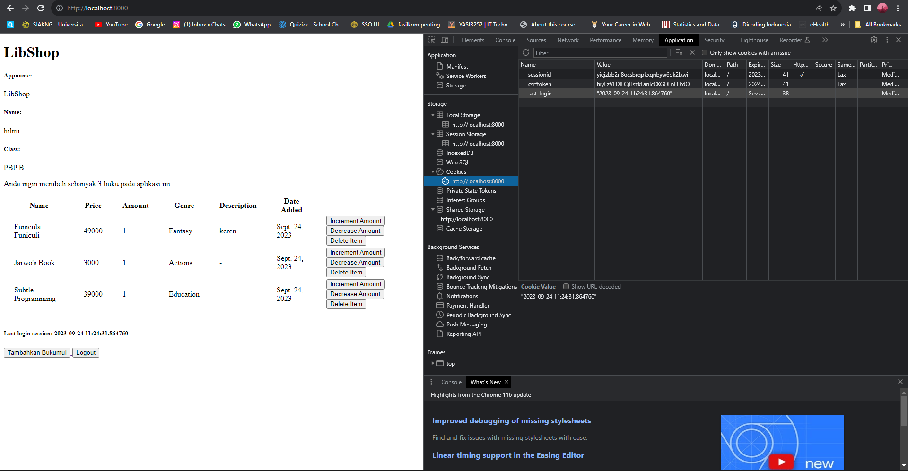

# libshop
Singkatan dari Library Shop
# [Link menuju LibShop](https://libshop.adaptable.app/main/)

<details>
<summary> TUGAS 2 </summary>

# Tugas 2 PBP 
# **Hilmi Atha Putra (2206830050) - PBP B**


Soal :
1. Jelaskan bagaimana cara kamu mengimplementasikan checklist di atas secara step-by-step (bukan hanya sekadar mengikuti tutorial).
2. Buatlah bagan yang berisi request client ke web aplikasi berbasis Django beserta responnya dan jelaskan pada bagan tersebut kaitan antara urls.py, views.py, models.py, dan berkas html.
3. Jelaskan mengapa kita menggunakan virtual environment? Apakah kita tetap dapat membuat aplikasi web berbasis Django tanpa menggunakan virtual environment?
4. Jelaskan apakah itu MVC, MVT, MVVM dan perbedaan dari ketiganya.

Jawab :
## **NOMOR 1**
A. Untuk membuat projek Django yang baru diperlukan beberapa step di bawah
   * Saya membuat direktori lokal baru bernama libshop untuk keperluan proyek saya
   * Untuk membuat proyek Django yang baru diperlukan untuk membuat _Virtual Environment_ agar direktori tersebut terisolasi dan _dependencies_ tidak bertabrakan satu sama lain dengan versi lain di device saya. Caranya dengan membuka terminal sesuai
     dengan direktori yang saya buat kemudian masukan line
     ```
     python -m venv env
     ```
     Kemudian untuk mengaktifkan _Virtual Environment_ masukan line
     ```
     env\Scripts\activate.bat
     ```
   * Karena _Virtual Environment_ sudah aktif, kita bisa menginstall semua dependencies yang diperlukan, sebelum itu saya membuat file requirements.txt untuk diisi dengan _dependencies_ yang diperlukan seperti django, gunicorn dan lain - lain untuk diinstall terlebih
     dahulu. setelah dibuat, kembali ke terminal dengan _Virtual Environment_ dan memasukkan line di bawah untuk menginstall semua dependencies yang diperlukan untuk proses deploying.
     ```
     pip install -r requirements.txt
     ```
   * Nah, untuk membuat proyek Django yang baru saya memasukkan line `django-admin startproject libshop .`
   * Karena proyek yang dibuat masih tahap uji coba, `ALLOWED HOST` pada `settings.py` ditambahkan bintang agar setiap hosts bisa mengakses aplikasi web
     ```
     ALLOWED_HOSTS = ["*"]
     ```
   * Lalu saya menambahkan file `.gitignore` dikarenakan terdapat berkas - berkas yang tidak perlu dilacak oleh git


B. Untuk membuat aplikasi `main` kembali ke terminal dengan _Virtual Environtment_ dan jalankan command `python manage.py startapp main`. setelah itu akan terbuat direktori aplikasi bernama main `main`. Tambahkan aplikasi    di variabel `INSTALLED APPS` pada
  `settings.py` yang berada di direktori proyek `libshop`. Tambahkan direktori `templates` pada direktori main dan tambahkan file `main.html` di dalam folder tersebut. File html tersebut    digunakan untuk mengatur tampilan aplikasi main pada web aplikasi.


C. Untuk melakukan routing proyek diperlukan  step di bawah
   * untuk mengonfigurasi routing aplikasi pada proyek kita membuka file `urls.py` pada direktori proyek `libshop` kemudian mengimpor fungsi `include` dari `django.urls` dan tambahkan path menuju tampilan main pada variabel `urlpattern` yaitu
     `path('main/',include('main.urls'))`


D. Membuat model bernama `Item` di file `models.py`. pada model `item` terdapat beberapa atribut yaitu :
  * name
  * date_added
  * price
  * amount
  * description
  * genre


E. Di dalam `views.py` yang berada di direktori aplikasi `main` saya tambahkan fungsi `show_main` dengan _context_ yang berisi nama aplikasi, nama saya, dan kelas PBP saya. Pada file `main.html` saya bisa mengakses isi dari _context_. contohnya jika saya ingin mengambil
nama, saya menulis `{{name}}` di file `main.html`

F. Untuk membuat routing pada aplikasi `main` saya membuat file python baru yaitu `urls.py` pada direktori aplikasi `main`. Di dalam file tersebut import `path` dari `django.urls` dan import `show_main` dari `main.views`, kemudian buat variable appname yang diisi 
`'main'` dan buat list bernama `urlpattern` dan isi dengan `path('', show_main, name='show_main')`

G. Untuk mendeploy aplikasi baru saya ke adaptable pertama saya harus membuat repositori baru di github kemudian hubungkan repositori lokal `libshop` dengan repositori github. Setelah itu lakukan add, commit, dan push. Terakhir, saya mendeploy aplikasi ke adaptable 


## **NOMOR 2**


`urls.py` berisi seluruh url yang ada dan django akan memilih url yang sesuai dengan request client, kemudian akan diteruskan ke `views.py`. View bisa berinteraksi dengan `models.py` untuk mendapatkan data /memodifikasi data yang dibutuhkan. Terakhir data tersebut 
akan disajikan melalui template/berkas html kemudian direspons ke pengguna


## **NOMOR 3**

_Virtual Environment_ sangat dianjurkan untuk digunakan saat kita ingin membuat proyek Django dikarenakan berguna untuk mengisolasi _package_ dan _dependency_. Hal itu diperlukan dikarenakan jika kita memiliki banyak proyek, masing - masing proyek akan terisolasi dan 
tidak berhubungan satu sama lain. Misalkan kita ingin mengupdate salah satu _depedency_ pada suatu proyek maka _depedency_ tersebut pada versi lain tidak akan ikut ter-update sehingga akan terhindar dari konflik antar proyek django

Kita bisa membuat proyek Django tanpa _virtual environment_ namun seperti yang dikatakan di atas, sangat tidak direkomendasikan dikarenakan bisa memicu konflik antar proyek django. contohnya adalah jika kita mempunyai proyek A yang menggunakan gunicorn versi 21.0.0,
dan kita ingin membuat proyek b yang menggunakan gunicorn versi terbaru yaitu 21.2.0, jika kita menginstall tanpa _virtual environment_, versi gunicorn pada proyek A akan berubah juga ke versi 21.2.0. _Virtual environtment_ sangat berguna untuk mengatur depedency antar 
proyek


## **NOMOR 4**

MVC, MVT, dan MVVM merupakan pola arsitektur yang umum digunakan pada pengembangan web dan aplikasi ponsel. berikut merupakan penjelasan mengenai ketiganya dan perbedaan - perbedaannya.
* MVC
  
  MVC merupakan singkatan dari Model View Controller. Model merupakan komponen yang mengatur data dan logika dari aplikasi atau web. Model juga menghubungkan aplikasi atau web dengan database. View merupakan komponen yang mengatur tampilan yang akan dilihat oleh
  pengguna. Terakhir, Controller adalah komponen yang mengatur hubungan antar Model dan View, memproses permintaan dari pengguna lalu berinteraksi dengan Model dan mengubah View

* MVT

  MVT merupakan singkatan dari Model View Template. Model merupakan komponen yang mengatur segala data dan logika inti dari aplikasi atau web. View pada MVT bertindak mirip seperti controller, mengambil data dari model dan mengatur bagaimana data tersebut ditampilkan.
  Template merupakan representasi visual dari aplikasi atau web (visual yang terlihat oleh pengguna)

* MVVM

  MVVM merupakan singkatan dari Model View ViewModel. Model merupakan komponen yang mengatur data dan logika inti. View mengatur visual yang akan dilihat pengguna. Dan terakhir, ViewModel berguna untuk _data binding_ untuk menyinkornkan penyajian fungsi dan data ke
  View serta pembaruan Model.

* Perbedaan

MVC dan MVT mirip namun pada MVT, View memiliki tugas yang mirip dengan controller untuk mengatur pengambilan data dan pada MVT terdapat komponen Template untuk menampilkan visual ke pengguna. Sedangkan pada MVVM lebih berfokus pada _data binding_, ViewModel pada MVVM
mengambil data dari Model dan mengubahnya menjadi format yang lebih mudah untuk dibaca oleh View. MVC dan MVT umum digunakan untuk kebanyakan aplikasi atau web sedangkan pada MVVM digunakan untuk aplikasi dengan UI yang lebih kompleks.


## **BONUS**

Selain tes url dan template yang ada di Tutorial 1, saya menambahkan tes baru yaitu tes model untuk mengecek apakah model yang dibuat bekerja dengan baik atau tidak

</details>

<details>
<summary> TUGAS 3 </summary>

# Tugas 3

1. Apa perbedaan antara form POST dan form GET dalam Django?

   Di dalam django, form POST dan form GET memiliki peran yang berbeda
   * Form GET digunakan untuk melakukan request terhadap database untuk meminta data tanpa mengubah isi/tidak ada efek samping. Cocok untuk pencarian, tampilan data, atau operasi baca.
   * Form POST digunakan untuk mengirim data ke database/server untuk diolah sehingga mengubah isi/memiliki efek. Cocok untuk operasi penambahan, pembaruan, penghapusan, atau operasi yang memerlukan pengiriman
     data yang kompleks.

2. Apa perbedaan utama antara XML, JSON, dan HTML dalam konteks pengiriman data?

   HTML merupakan struktur utama dalap web development, digunakan untuk mengatur bagaimana data ditampilkan atau halaman ditampilkan. Sedangkan XML dan JSON digunakan untuk pertukaran data dengan server.
   JSON mudah untuk dibaca dan ditulis oleh manusia dan mudah untuk diurai dan dihasilkan oleh mesin. JSON memiliki sintaks yang lebih sederhana dibandingkan XML dan membutuhkan lebih sedikit teks untuk
   menggambarkan data yang sama. JSON digunakan juga untuk integrasi dengan Javascript. Sedangkan XML  mengkodekan dokumen dalam format yang bisa dibaca oleh manusia dan mesin. XML sering digunakan dalam
   aplikasi web untuk pertukaran data karena struktur hierarkinya yang jelas(tree)

3.  Mengapa JSON sering digunakan dalam pertukaran data antara aplikasi web modern?

    JSON lebih mudah digunakan serta lebih mudah dibaca daripada XML. Tidak perlu tag , atribut, skema, dan lain - lain. JSON juga kompatibel dengan javascript sehingga lebih terintegrasi pada banyak web. JSON
    juga mudah digunakan dengan bahasa lain sehingga lebih mudah untuk pertukaran data antar sistem

4. Jelaskan bagaimana cara kamu mengimplementasikan checklist di atas secara step-by-step (bukan hanya sekadar mengikuti tutorial).

  * Membuat input form untuk menambahkan objek model pada app sebelumnya.
    
      * Membuat berkas `forms.py` pada direktori aplikasi `main`
      * Membuat class `ProductForm` pada `forms.py` yang memiliki argumen `ModelForm`
      * Di dalam class tersebut, di buat class `META` yang berisi model yang kita gunakan, padak konteks ini `model=Item`. Selain itu, berisi juga fields yang bisa diisi user yaitu
        ` fields = ["name", "price", "description", "genre", "amount"]`
      * Membuat fungsi create_product di dalam `views.py` yang menerima parameter request. Di dalam `create_product`, kita membuat sebuah `ProductForm` baru yang diisi dengan argumen `request.POST`
        dalam bentuk `QueryDict`. Kemudian kita memvalidasi kontennya dengan menggunakan `form.is_valid()` dan menyimpan kontennya dengan menggunakan `form.save()`. Jika kontennya berhasil disimpan, kembali ke
        halaman utama dengan menggunakan return `HttpResponseRedirect(reverse('main:show_main'))`. Fungsi tersebut akan menampilkan `create_product.html`.
      * Mengubah `show_main` pada `views.py` dengan menambahkan kode `item = Item.objects.all()` untuk menampilkan data item yang ditambahkan dan kode `item_count = item.count()` untuk mendapatkan jumlah item
        yang ada.
      * Melakukan routing di `urls.py` pada direktori aplikasi `main` dengan menambahkan `path('create-product', create_product, name='create_product')` di `urlpatterns
      * Membuat tampilan create_product dengan menambahkan `create_product.html` pada `templates` direktori aplikasi `main`. Isilah berkas HTML dengan kode yang sesuai untuk menampilkan form dalam bentuk
        tabel, gunakan `` untuk security, dan gunakan tag `<form method="POST">` untuk menandai formulir dengan metode POST.
   
  * Tambahkan 5 fungsi views untuk melihat objek yang sudah ditambahkan dalam format HTML, XML, JSON, XML by ID, dan JSON by ID.
      * HTML sudah dijelaskan pada point pertama dan ditampilkan pada `main.html` yang fungsi `views.py`nya `show_main`
      * XML
          * Membuat fungsi `show_xml` pada `views.py` kemudian isi dengan kode dibawah agar data yang diambil pada objek model Item bisa direturn dalam format XML
            ```
            def show_xml(request):
            data = Item.objects.all()
            return HttpResponse(serializers.serialize("xml", data), content_type="application/xml")
            ```
            Serializers digunakan untuk mentranslasikan objek model ke xml
      * JSON
          * Membuat fungsi `show_json` pada `views.py` kemudian isi dengan kode dibawah agar data yang diambil pada objek model Item bisa direturn dalam format JSON
            ```
            def show_json(request):
            data = Item.objects.all()
            return HttpResponse(serializers.serialize("json", data), content_type="application/json")
            ```
            Serializers digunakan untuk mentranslasikan objek model ke json
        * XML by ID
            * Mengambil objek Item berdasarkan id dan direturn dalam format XML dengan menambahkan fungsi `show_xml_id` pada `views.py` dan menambahkan kode
              ```
              def show_xml_by_id(request, id):
              data = Item.objects.filter(pk=id)
              return HttpResponse(serializers.serialize("xml", data), content_type="application/xml")
              ```
        * JSON by ID
            * Mengambil objek Item berdasarkan id dan direturn dalam format json dengan menambahkan fungsi `show_json_id` pada `views.py` dan menambahkan kode
              ```
              def show_json_by_id(request, id):
              data = Item.objects.filter(pk=id)
              return HttpResponse(serializers.serialize("json", data), content_type="application/json")
              ```
  * Membuat routing URL untuk masing-masing views yang telah ditambahkan pada poin 2.
      * HTML
          * Sudah dilakukan routing pada `urls.py` direktori aplikasi `main` yaitu bagian
            ```
            ...
            path('', show_main, name='show_main'),
            ...
            ```
      * XML
          * menambahkan routing pada `urls.py` pada direktori aplikasi `main` dengan kode `path('xml/', show_xml, name='show_xml'),` tepatnya di `urlpatterns`
      * JSON
          * menambahkan routing pada `urls.py` pada direktori aplikasi `main` dengan kode `path('json/', show_json, name='show_json'),` tepatnya di `urlpatterns`
      * XML by ID
          * menambahkan routing pada `urls.py` pada direktori aplikasi `main` dengan kode `path('xml/<int:id>/', show_xml_by_id, name='show_xml_by_id'),` tepatnya di `urlpatterns`
      * JSON by ID
          * menambahkan routing pada `urls.py` pada direktori aplikasi `main` dengan kode `path('json/<int:id>/', show_json_by_id, name='show_json_by_id'),` tepatnya di `urlpatterns`

6. Mengakses kelima URL di poin 2 menggunakan Postman, membuat screenshot dari hasil akses URL pada Postman, dan menambahkannya ke dalam README.md.

  * HTML
  

  * json
  

  * xml
  

  * json by id
  

  * xml by id
  

7. Bonus

   Saya telah menambahkan `item_count` pada fungsi `show_main` yang ada di `views.py` direktori aplikasi `main` untuk menyimpan jumlah buku/item yang sudah dibuat. kemudian ditambahkan di `context` dan
   ditampilkan di `main.html`

</details>


<details>
<summary> TUGAS 4 </summary>

# Tugas 4

1.  Apa itu Django UserCreationForm, dan jelaskan apa kelebihan dan kekurangannya?
    
    * Django UserCreationForm merupakan built in form yang disediakan oleh Django untuk 
      keperluan pembuatan akun pada web/aplikasi yang kita buat. Terdapat 3 field yaitu 
      username, password, dan password confirmation. Kelebihan dari UserCreationForm adalah 
      mudah digunakan dan diimplementasikan lalu memiliki validasi bawaan untuk memastikan
      masukan dari user benar. Sedangkan kekurangannya adalah tampilan bawaannya default dan
      kurang menarik dan memiliki batasan validasi data yang spesifik

2. Apa perbedaan antara autentikasi dan otorisasi dalam konteks Django, dan mengapa keduanya 
   penting?
   
   * Dalam konteks Django, autentikasi dan otorisasi adalah dua konsep yang berbeda. 
     Autentikasi adalah proses verifikasi identitas pengguna, yaitu memastikan bahwa 
     pengguna yang mencoba mengakses aplikasi adalah benar-benar pengguna yang terdaftar dan 
     memiliki hak akses. Sedangkan otorisasi adalah proses memberikan hak akses kepada 
     pengguna yang telah terautentikasi, yaitu menentukan apa yang dapat dilakukan oleh 
     pengguna tersebut dalam aplikasi.Autentikasi dan otorisasi adalah dua prosesyang sangat 
     penting yang digunakan oleh administrator untuk melindungi sistem dan informasi. 
     Autentikasi memverifikasi identitas pengguna atau layanan, dan otorisasi menentukan hak 
     akses mereka

3. Apa itu cookies dalam konteks aplikasi web, dan bagaimana Django menggunakan cookies 
untuk mengelola data sesi pengguna?

    *  Cookies adalah file kecil yang disimpan pada komputer pengguna oleh situs web yang   dikunjungi. Cookies digunakan untuk menyimpan informasi tentang pengguna dan preferensi mereka, seperti login, preferensi bahasa, dan riwayat pencarian. Dalam konteks aplikasi web, cookies digunakan untuk mengelola data sesi pengguna, yaitu informasi yang disimpan oleh server tentang pengguna selama mereka menggunakan aplikasi web.

    * Django menggunakan cookies untuk mengelola data sesi pengguna dengan menyimpan session ID pada cookie. Ketika pengguna mengakses aplikasi web, Django akan membuat session ID baru dan menyimpannya pada cookie. Setiap kali pengguna melakukan permintaan ke server, session ID akan dikirimkan bersama permintaan tersebut. Server kemudian akan menggunakan session ID untuk mengambil data sesi pengguna dari penyimpanan server dan mengirimkannya kembali ke pengguna. Dengan menggunakan cookies, Django dapat mengelola data sesi pengguna dengan aman dan efisien.

4. Apakah penggunaan cookies aman secara default dalam pengembangan web, atau apakah ada risiko potensial yang harus diwaspadai?

    * Penggunaan cookies dalam pengembangan web memiliki risiko potensial yang harus diwaspadai. Cookies dapat digunakan untuk menyimpan informasi sensitif seperti login dan informasi kartu kredit, dan jika tidak diimplementasikan dengan benar, cookies dapat menjadi sumber kerentanan keamanan. Ada beberapa risiko potensial yang harus diwaspadai, seperti serangan cookie stealing, serangan XSS (Cross-Site Scripting), dan serangan CSRF (Cross-Site Request Forgery). Oleh karena itu, sangat penting untuk mengimplementasikan cookies dengan benar dan mengambil tindakan keamanan yang diperlukan untuk melindungi informasi sensitif pengguna. Beberapa tindakan keamanan yang dapat dilakukan termasuk mengenkripsi data cookies, menetapkan waktu kadaluwarsa yang tepat, dan memastikan bahwa cookies hanya digunakan pada koneksi yang aman. 

5.  Jelaskan bagaimana cara kamu mengimplementasikan checklist di atas secara step-by-step (bukan hanya sekadar mengikuti tutorial).
  * Mengimplementasikan fungsi registrasi, login, dan logout untuk memungkinkan pengguna untuk mengakses aplikasi sebelumnya dengan lancar.
    * Membuat fungsi registrasi
      * Di dalam `views.py` direktori aplikasi `main`, import beberapa library berikut
        ```
        from django.shortcuts import redirect
        from django.contrib.auth.forms import UserCreationForm
        from django.contrib import messages  
        ```
        membuat fungsi baru yaitu `register` yang meminta parameter request dan diisi dengan kode berikut
        ```
        def register(request):
          form = UserCreationForm()

          if request.method == "POST":
              form = UserCreationForm(request.POST)
              if form.is_valid():
                  form.save()
                  messages.success(request, 'Your account has been successfully created!')
                  return redirect('main:login')
          context = {'form':form}
          return render(request, 'register.html', context)
        ```
        lalu pada direktori `template` pada direktori aplikasi `main` dibuat file `register.html` untuk membuat halaman yang akan ditampilkan saat register. Buat routing pada `urls,py` direktori aplikasi `main`
    * Membuat fungsi login
      * Di dalam `views.py` direktori aplikasi `main`, import beberapa library berikut
        ```
        from django.contrib.auth import authenticate, login 
        ```
        kemudian membuat fungsi baru `login_user` di `views.py` direktori aplikasi kemudian diisi dengan kode dibawah.
        ```
        def login_user(request):
          if request.method == 'POST':
              username = request.POST.get('username')
              password = request.POST.get('password')
              user = authenticate(request, username=username, password=password)
              if user is not None:
                  login(request, user)
                  response = HttpResponseRedirect(reverse("main:show_main")) 
                  response.set_cookie('last_login', str(datetime.datetime.now()))
                  return response
              else:
                  messages.info(request, 'Sorry, incorrect username or password. Please try again.')
          context = {}
          return render(request, 'login.html', context)
        ```
        maanfaatkan cookie dengan menambahkan line `response.set_cookie('last_login', str(datetime.datetime.now()))` saat user berhasil login dengan key `last_login` dan value tanggal login saat itu. Pada direktori `template` buat file `login.html` untuk membuat halaman yang akan ditampilkan saat register. Buat routing pada `urls.py` direktori aplikasi.
    * membuat fungsi logout
      * Di dalam `views.py` direktori aplikasi `main`, import beberapa library berikut
        ```
        from django.contrib.auth import logout
        ```
        kemudian membuat fungsi baru `logout_user` di `views.py` direktori aplikasi kemudian diisi dengan kode dibawah.
        ```
        def logout_user(request):
          logout(request)
          response = HttpResponseRedirect(reverse('main:login'))
          response.delete_cookie('last_login')
          return response
        ```
        dilakukan penghapusan cookie dengan key `last_login` saat user logout. kemudian membuat routing pada `urls.py` direktori aplikasi
    * Restriksi akses aplikasi
      * di dalam `views.py` import `login_required` dan tambahkan `@login_required(login_url='/login')` di atas fungsi `show_main`


  * Membuat dua akun pengguna dengan masing-masing tiga dummy data menggunakan model yang telah dibuat pada aplikasi sebelumnya untuk setiap akun di lokal. 
    * lakukan register untuk 2 akun dan tambahkan 3 produk pada setiap akun. Tampilannya akan seperti di bawah
       
       
  
  * Menghubungkan model Item dengan User.
    

    di dalam `models.py` import user kemudian tambahkan `user = models.ForeignKey(User, on_delete=models.CASCADE)` di dalam class model `Item`. Ubah fungsi `create_product` dengan kode di bawah agar buku yang dibuat terasosiasi pada satu user
    ```
    def create_product(request):
      form = ProductForm(request.POST or None)

      if form.is_valid() and request.method == "POST":
          product = form.save(commit=False)
          product.user = request.user
          product.save()
          return HttpResponseRedirect(reverse('main:show_main'))
    ...
    ```
  * Menampilkan detail informasi pengguna yang sedang logged in seperti username dan menerapkan cookies seperti last login pada halaman utama aplikasi.
    * Menampilkan username pengguna

      Pada fungsi `show_main` di `views.py` ubah isi context dengan key `'name'` menjadi
      ```
      'name': request.user.username,
      ```
    * menerapkan cookies last login

      penerapan cookies sudah dijelaskan di atas dan untuk menampilkan last login, tambahkan kode di bawah pada context fungsi `show_main`
      ```
      'last_login': request.COOKIES['last_login'],
      ```
      lalu di `main.html` tambahkan kode
      ```
      <h5>Last login session: {{ last_login }}</h5>
      ```
    * tampilan

      

6. Bonus

  * Pada `views.py` tambahkan kode berikut pada fungsi `show_main`
    
    ```
    def show_main(request):
      items = Item.objects.filter(user=request.user)
      if request.method == 'POST':
          if 'increment' in request.POST:
              item_id = request.POST.get('increment')
              item = items.get(id=item_id)
              item.amount += 1
              item.save()
              return HttpResponseRedirect(reverse('main:show_main'))
          elif 'decrement' in request.POST:
              item_id = request.POST.get('decrement')
              item = items.get(id=item_id)
              item.amount -= 1
              item.save()
              return HttpResponseRedirect(reverse('main:show_main'))
          elif 'delete' in request.POST:
              item_id = request.POST.get('delete')
              item = items.get(id=item_id)
              item.delete()
              return HttpResponseRedirect(reverse('main:show_main'))
    ...
    ```
  * kemudian pada `main.html` ubah tabel menjadi 
    ```
    <table>
      <tr>
          <th>Name</th>
          <th>Price</th>
          <th>Amount</th>
          <th>Genre</th>
          <th>Description</th>
          <th>Date Added</th>
      </tr>

       Berikut cara memperlihatkan data produk di bawah baris ini 

      
          <tr>
              <td>{{item.name}}</td>
              <td>{{item.price}}</td>
              <td>{{item.amount}}</td>
              <td>{{item.genre}}</td>
              <td>{{item.description}}</td>
              <td>{{item.date_added}}</td>
              <td>
                  <form method="post">
                      
                      <button type="submit" name="increment" value="{{ item.id }}">
                          Increment Amount
                      </button>
                      <button type="submit" name="decrement" value="{{ item.id }}">
                          Decrease Amount
                      </button>
                      <button type="submit" name="delete" value="{{ item.id }}">
                          Delete Item
                      </button>
                  </form>
              </td>
          </tr>
      
    </table>
    ```
  dibuat tiga tombol yaitu increment, decrement dan delete item dengan request methot POST

</details>


<details>
<summary> TUGAS 5 </summary>

  # Tugas 5

  1. Jelaskan manfaat dari setiap element selector dan kapan waktu yang tepat untuk menggunakannya. 
      * Element selector adalah salah satu jenis selector di CSS yang digunakan untuk memilih elemen HTML berdasarkan nama tag-nya. Berikut adalah manfaat dari penggunaan element selector dan kapan waktu yang tepat untuk menggunakannya:

          * Memilih semua elemen dengan tag yang sama Manfaat: Dapat digunakan untuk memberikan styling yang sama pada semua elemen dengan tag yang sama. Contoh: p { color: red; }

          * Memilih elemen dengan tag tertentu yang berada di dalam elemen lain Manfaat: Dapat digunakan untuk memberikan styling pada elemen dengan tag tertentu yang berada di dalam elemen lain, tanpa mempengaruhi elemen dengan tag yang sama di luar elemen tersebut. Contoh: div p { color: blue; }

          * Memilih elemen dengan tag tertentu yang memiliki class tertentu Manfaat: Dapat digunakan untuk memberikan styling pada elemen dengan tag tertentu yang memiliki class tertentu. Contoh: p.warning { color: orange; }

          * Memilih elemen dengan tag tertentu yang memiliki ID tertentu Manfaat: Dapat digunakan untuk memberikan styling pada elemen dengan tag tertentu yang memiliki ID tertentu. Contoh: #header { background-color: gray; }

      * Waktu yang tepat untuk menggunakan element selector adalah ketika kita ingin memberikan styling pada elemen HTML berdasarkan tag-nya. Namun, perlu diingat bahwa penggunaan selector yang terlalu spesifik dapat membuat kode CSS menjadi sulit untuk dipelihara. Oleh karena itu, sebaiknya gunakan selector yang paling sederhana dan spesifik yang memungkinkan untuk mencapai tujuan styling yang diinginkan.
  
  2. Jelaskan HTML5 Tag yang kamu ketahui.
      * `<header>` - digunakan untuk menunjukkan bagian atas dari sebuah halaman web atau bagian atas dari sebuah bagian pada halaman web.
      * `<nav>` - digunakan untuk menunjukkan bagian navigasi pada sebuah halaman web.
      * `<section>` - digunakan untuk menunjukkan sebuah bagian pada sebuah halaman web.
      * `<article>` - digunakan untuk menunjukkan sebuah artikel pada sebuah halaman web.
      * `<aside>` - digunakan untuk menunjukkan sebuah bagian yang terkait dengan konten utama pada sebuah halaman web.
      * `<footer>` - digunakan untuk menunjukkan bagian bawah dari sebuah halaman web atau bagian bawah dari sebuah bagian pada halaman web.
  
  3. Jelaskan perbedaan antara margin dan padding.
      * Margin dan padding adalah dua konsep penting dalam CSS yang digunakan untuk mengatur tata letak dan tampilan elemen HTML. Berikut adalah perbedaan antara margin dan padding:

          * Margin adalah ruang kosong di sekitar elemen HTML. Margin digunakan untuk memberikan jarak antara elemen HTML dengan elemen lain di sekitarnya. Margin dapat diatur dengan menggunakan properti CSS seperti margin-top, margin-bottom, margin-left, dan margin-right.

          * Padding adalah ruang kosong di dalam elemen HTML, antara tepi elemen dan konten di dalamnya. Padding digunakan untuk memberikan jarak antara konten elemen HTML dengan tepi elemen tersebut. Padding dapat diatur dengan menggunakan properti CSS seperti padding-top, padding-bottom, padding-left, dan padding-right.

      * Dalam hal penggunaannya, margin dan padding dapat digunakan untuk mencapai efek yang sama, yaitu memberikan jarak antara elemen HTML. Namun, perbedaan utama antara keduanya adalah bahwa margin memberikan jarak antara elemen HTML dengan elemen lain di sekitarnya, sedangkan padding memberikan jarak antara konten elemen HTML dengan tepi elemen tersebut.
  
  4. Jelaskan perbedaan antara framework CSS Tailwind dan Bootstrap. Kapan sebaiknya kita menggunakan Bootstrap daripada Tailwind, dan sebaliknya?
      * Tailwind dan Bootstrap adalah dua framework CSS yang populer digunakan dalam pengembangan web. Berikut adalah perbedaan antara keduanya:

        * Filosofi Desain

          * Bootstrap memiliki filosofi desain yang lebih terstruktur dan konsisten. Bootstrap memiliki gaya desain yang lebih kaku dan lebih mudah diimplementasikan oleh pengembang yang tidak memiliki latar belakang desain yang kuat.
          * Tailwind memiliki filosofi desain yang lebih fleksibel dan memberikan lebih banyak kebebasan dalam desain. Tailwind memungkinkan pengembang untuk membuat desain yang lebih unik dan kreatif.
        * Ukuran File

          * Bootstrap memiliki ukuran file yang lebih besar dibandingkan dengan Tailwind. Hal ini disebabkan oleh banyaknya fitur yang disediakan oleh Bootstrap.
          * Tailwind memiliki ukuran file yang lebih kecil dibandingkan dengan Bootstrap. Hal ini disebabkan oleh pendekatan yang lebih modular dan fleksibel dalam penggunaan kelas-kelas CSS.
        * Kustomisasi

          * Bootstrap memiliki banyak tema dan template yang dapat digunakan untuk mempercepat proses pengembangan. Namun, kustomisasi yang lebih lanjut dapat menjadi sulit karena Bootstrap memiliki banyak aturan dan struktur yang harus diikuti.
          * Tailwind memungkinkan pengembang untuk membuat desain yang lebih unik dan kreatif. Tailwind memberikan lebih banyak kebebasan dalam kustomisasi karena pengembang dapat membuat kelas-kelas CSS yang sesuai dengan kebutuhan mereka.
        * Penggunaan

          * Bootstrap lebih cocok digunakan untuk proyek-proyek yang membutuhkan desain yang konsisten dan mudah diimplementasikan. Bootstrap cocok digunakan untuk proyek-proyek yang membutuhkan waktu pengembangan yang cepat.
          * Tailwind lebih cocok digunakan untuk proyek-proyek yang membutuhkan desain yang lebih unik dan kreatif. Tailwind cocok digunakan untuk proyek-proyek yang membutuhkan kustomisasi yang lebih lanjut dan fleksibilitas dalam penggunaan kelas-kelas CSS.
      * Sebaiknya menggunakan Bootstrap jika  membutuhkan desain yang konsisten dan mudah diimplementasikan, serta membutuhkan waktu pengembangan yang cepat. Sebaliknya, sebaiknya menggunakan Tailwind jika  membutuhkan desain yang lebih unik dan kreatif, serta membutuhkan kustomisasi yang lebih lanjut dan fleksibilitas dalam penggunaan kelas-kelas CSS.
  
5. Jelaskan bagaimana cara kamu mengimplementasikan checklist di atas secara step-by-step (bukan hanya sekadar mengikuti tutorial).
  * Mengubah `base.html` dengan menambahkan kode di bawah untuk mengimplementasikan bootstrap 
    ```
    <head>
        <meta charset="UTF-8" />
        <meta
            name="viewport"
            content="width=device-width, initial-scale=1.0"
        />
        
        <title>Libshop</title>
        <link rel="stylesheet" href="">
        
        <link href="https://cdn.jsdelivr.net/npm/bootstrap@5.3.2/dist/css/bootstrap.min.css" rel="stylesheet" integrity="sha384-T3c6CoIi6uLrA9TneNEoa7RxnatzjcDSCmG1MXxSR1GAsXEV/Dwwykc2MPK8M2HN" crossorigin="anonymous">
        <script src="https://code.jquery.com/jquery-3.6.0.min.js" integrity="sha384-KyZXEAg3QhqLMpG8r+J4jsl5c9zdLKaUk5Ae5f5b1bw6AUn5f5v8FZJoMxm6f5cH1" crossorigin="anonymous"></script>
        <script src="https://cdn.jsdelivr.net/npm/@popperjs/core@2.11.8/dist/umd/popper.min.js" integrity="sha384-I7E8VVD/ismYTF4hNIPjVp/Zjvgyol6VFvRkX/vR+Vc4jQkC+hVqc2pM8ODewa9r" crossorigin="anonymous"></script>
        <script src="https://cdn.jsdelivr.net/npm/bootstrap@5.3.2/dist/js/bootstrap.min.js" integrity="sha384-BBtl+eGJRgqQAUMxJ7pMwbEyER4l1g+O15P+16Ep7Q9Q+zqX6gSbd85u4mG4QzX+" crossorigin="anonymous"></script>
    </head>
    ```
  * Kustomisasi tampilan login.html
  ```
  

  
      <title>Login</title>
  

  
  <div class="container">
      <div class="row justify-content-center">
          <div class="col-md-6">
              <div class="card">
                  <div class="card-header"><h1>Login</h1></div>
                  <div class="card-body">
                      <form method="POST" action="">
                          
                          <div class="form-group mb-3">
                              <label for="username">Username:</label>
                              <input type="text" name="username" id="username" class="form-control" placeholder="Username">
                          </div>
                          <div class="form-group mb-3">
                              <label for="password">Password:</label>
                              <input type="password" name="password" id="password" class="form-control" placeholder="Password">
                          </div>
                          <div class="form-group">
                              <input class="btn btn-primary" type="submit" value="Login">
                          </div>
                      </form>
                      
                          <ul class="list-group">
                              
                                  <li class="list-group-item">{{ message }}</li>
                              
                          </ul>
                      
                      <p>Don't have an account yet? <a href="">Register Now</a></p>
                  </div>
              </div>
          </div>
      </div>
  </div>
  

  ```
  Saya memanfaatkan bootstrap untuk tampilan login saya, saya memanfaatkan container `card` untuk menampilkan form login. 

  * Kustomisasi tampilan laman register
    ```
    

    
        <title>Register</title>
    

      

    <div class="container">
        <div class="row justify-content-center">
            <div class="col-md-6">
                <div class="card">
                    <div class="card-header"><h1>Register</h1></div>
                    <div class="card-body">
                        <form method="POST">
                            
                            <div class="form-group mb-3">
                                {{ form.username.label_tag }}
                                {{ form.username }}
                            </div>
                            <div class="form-group mb-3">
                                {{ form.email.label_tag }}
                                {{ form.email }}
                            </div>
                            <div class="form-group mb-3">
                                {{ form.password1.label_tag }}
                                {{ form.password1 }}
                            </div>
                            <div class="form-group mb-3">
                                {{ form.password2.label_tag }}
                                {{ form.password2 }}
                            </div>
                            <div class="form-group mb-3">
                                <input class="btn btn-primary" type="submit" name="submit" value="Register">
                            </div>
                        </form>
                        
                            <ul class="list-group">
                                
                                    <li class="list-group-item">{{ message }}</li>
                                
                            </ul>
                        
                    </div>
                </div>
            </div>
        </div>
    </div>

    

    ```
  Saya memanfaatkan bootstrap untuk tampilan register saya, saya memanfaatkan container `card` untuk menampilkan form login. 

  * Kustomisasi laman menambah produk
  ```
  

  
      <title>Add New Book</title>
  

  
  <div class="container">
      <div class="row justify-content-center">
          <div class="col-md-6">
              <div class="card">
                  <div class="card-header"><h1>Add New Book</h1></div>
                  <div class="card-body">
                      <form method="POST">
                          
                          <table class="table">
                              {{ form.as_table }}
                              <tr>
                                  <td></td>
                                  <td>
                                      <input class="btn btn-primary" type="submit" value="Add Book">
                                      <a class="btn btn-secondary" href="">Cancel</a>
                                  </td>
                              </tr>
                          </table>
                      </form>
                  </div>
              </div>
          </div>
      </div>
  </div>
  
  ```
  Saya memanfaatkan bootstrap untuk tampilan menambah produk saya, saya memanfaatkan container `card` untuk menampilkan form menambah produk. Saya juga menambahkan button cancel untuk kembali ke main apabila tidak jadi membuat buku baru.

* Kustomisasi laman utama serta implementasi bonus
```



<div class="container my-4">
    <style>
        .last-item {
            /* Warna background atau teks yang berbeda pada baris terakhir */
            background-color: #00e1ff; /* Contoh warna background kuning */
            color: #ffffff; /* Contoh warna teks hitam */
        }
    </style>    
    <h1 class="mb-4">{{ app_name }}</h1>

    <div class="mb-4">
        <h5>Appname: {{ app_name }}</h5>
        <h5>Name: {{ name }}</h5>
        <h5>Class: {{ class }}</h5>
        <p>Anda ingin membeli sebanyak {{ jumlah_item }} buku pada aplikasi ini </p>
    </div>

    
    <div class="card mb-3 last-item">
        <div class="card-header">
            {{item.name}}
        </div>
        <div class="card-body">
            <p><strong>Price:</strong> {{item.price}}</p>
            <p><strong>Amount:</strong> {{item.amount}}</p>
            <p><strong>Genre:</strong> {{item.genre}}</p>
            <p><strong>Description:</strong> {{item.description}}</p>
            <p><strong>Date Added:</strong> {{item.date_added}}</p>

            <form method="post" class="mt-2">
                
                <button type="submit" name="increment" value="{{ item.id }}" class="btn btn-success btn-sm">Increment Amount</button>
                <button type="submit" name="decrement" value="{{ item.id }}" class="btn btn-warning btn-sm">Decrease Amount</button>
                <button type="submit" name="delete" value="{{ item.id }}" class="btn btn-danger btn-sm">Delete Item</button>
            </form>
        </div>
    </div>
    

    <div class="my-4">
        <h5>Last login session: {{ last_login }}</h5>
    </div>

    <a href="" class="btn btn-primary">Tambahkan Bukumu!</a>
    <a href="" class="btn btn-danger">Logout</a>
</div>

```
Saya memanfaatkan bootstrap untuk tampilan laman utama saya, saya memanfaatkan container `card` untuk menampilkan data produk. Saya juga menambahkan class `last-item` untuk memberikan warna background yang berbeda pada baris terakhir. saya memanfaatkan in-line style css untuk mengimplementasikan bonus yaitu pada kode
```
...
<style>
      .last-item {
          /* Warna background atau teks yang berbeda pada baris terakhir */
          background-color: #00e1ff; /* Contoh warna background kuning */
          color: #ffffff; /* Contoh warna teks hitam */
      }
</style> 
...
```
kemudian mengubah class item untuk memanfaatkan style last-item 
```
...
<div class="card mb-3 last-item">
...
</div>
```

</details>


  
      
      

